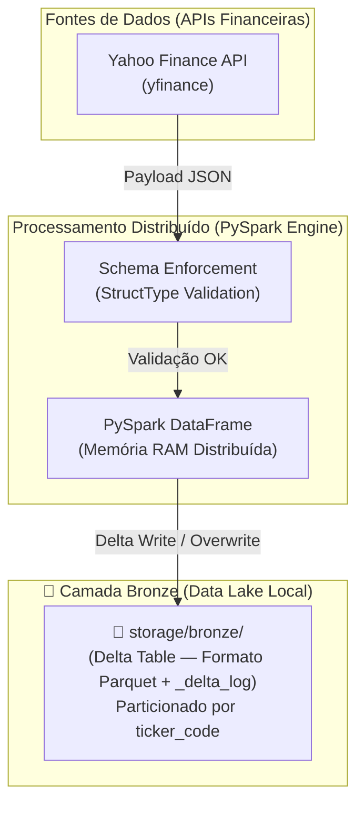
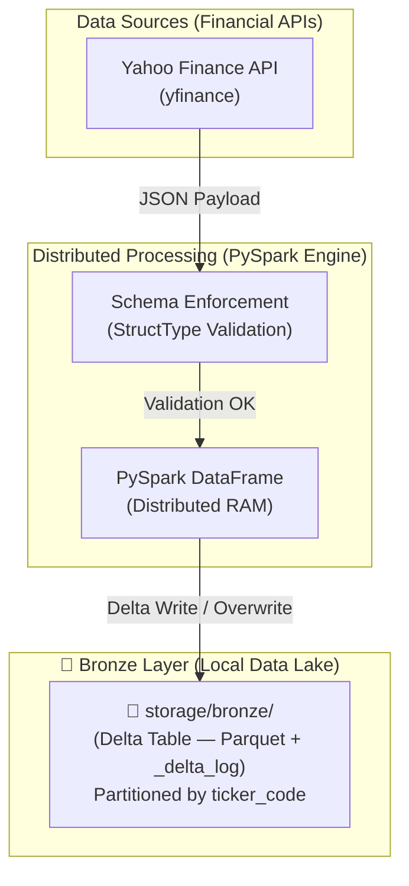

# 🚀 Data Lakehouse Financeiro — PySpark + Delta Lake + Apache Airflow


[🇧🇷 Português](#português) | [🇺🇸 English](#english)

---

<a name="português"></a>
## 🇧🇷 Português

Este repositório contém a implementação de um **Data Lakehouse** local com arquitetura **Medallion** (Bronze → Silver → Gold), utilizando processamento distribuído em **PySpark**, armazenamento ACID resiliente em **Delta Lake** (com Time Travel e Schema Enforcement) e orquestração automatizada pelo **Apache Airflow**.

### 🏗️ 1. Arquitetura do Pipeline (Camada Bronze)



### 💡 Decisões de Arquitetura

| Decisão | Justificativa de Engenharia |
| :--- | :--- |
| **Delta Lake (Transações ACID)** | Garante gravação segura (*Atomicidade*). Se a ingestão quebrar no meio, o Data Lake permanece 100% íntegro. |
| **Schema Enforcement (`StructType`)** | Contrato de dados estrito na entrada. Rejeita tipos de dados incompatíveis antes da gravação. |
| **Particionamento por `ticker_code`** | *Partition Pruning*: Permite que consultas futuras leiam apenas as pastas do ativo desejado sem varrer o dataset inteiro. |

---

<a name="english"></a>
## 🇺🇸 English

This repository contains a local **Data Lakehouse** implementation with **Medallion** architecture (Bronze → Silver → Gold), powered by **PySpark** distributed processing, **Delta Lake** ACID resilient storage (Time Travel & Schema Enforcement), and orchestrated by **Apache Airflow**.

### 🏗️ 1. Pipeline Architecture (Bronze Layer)



### 💡 Architectural Decisions

| Decision | Engineering Rationale |
| :--- | :--- |
| **Delta Lake (ACID Transactions)** | Ensures atomic writes. If ingestion fails mid-way, the Data Lake remains 100% consistent without data corruption. |
| **Schema Enforcement (`StructType`)** | Strict data contract on entry. Rejects incompatible data types before writing to disk. |
| **Partitioning by `ticker_code`** | *Partition Pruning*: Enables future queries to scan only targeted ticker directories instead of scanning the full dataset. |

---

## 🛠️ How to Run / Como Executar

```bash
# 1. Environment Setup
sudo apt update && sudo apt install -y openjdk-17-jdk
python3 -m venv .venv
source .venv/bin/activate
pip install -r requirements.txt

# 2. Run Jupyter Notebook
jupyter notebook
```

---

*Desenvolvido por / Developed by **Ericles Fernandes Oliveira** · Engenharia de Dados* 🚀
