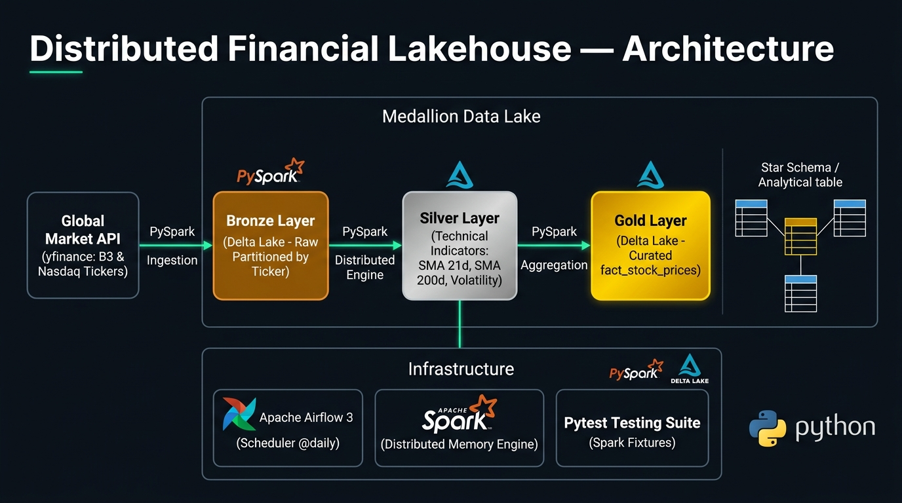
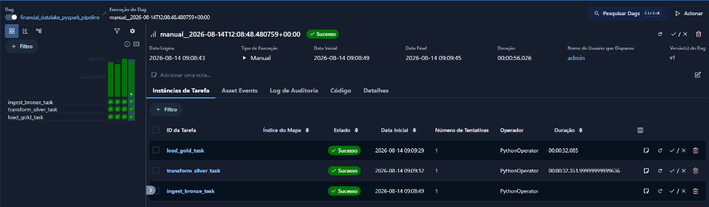
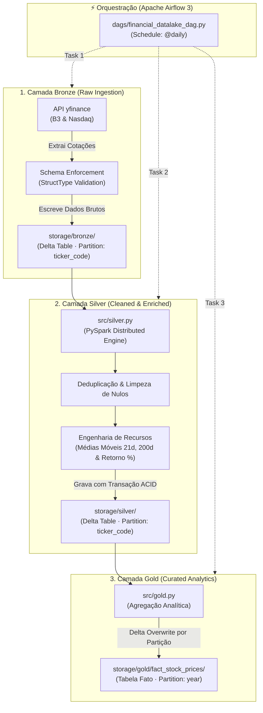

# 🚀 Financial Data Lakehouse — PySpark, Delta Lake & Apache Airflow 3


*(Bilingual Documentation: [Português](#-português) | [English](#-english))*

---

## 🏗️ Architecture Blueprint / Diagrama de Arquitetura

<p align="center">
  
</p>

---

## 📋 Pré-Requisitos / Prerequisites

- **Java 17 (OpenJDK)** — Obrigatório para o funcionamento da JVM do Apache Spark
- **Python >= 3.12**
- **Apache Airflow 3.x** (Opcional para orquestração automatizada)

---

## 🇧🇷 Português

Este projeto implementa uma plataforma completa de **Data Lakehouse Financeiro** utilizando a **Arquitetura Medalhão** (Bronze ➔ Silver ➔ Gold). A solução combina o poder de processamento massivo distribuído do **Apache Spark (PySpark)** com as garantias de transações ACID e Time Travel do **Delta Lake**, orquestrada em produção pelo **Apache Airflow 3** e validada com uma suíte de testes unitários em **Pytest**.

---

### 🖥️ Orquestração Automatizada no Apache Airflow 3

<p align="center">
  
</p>

- **Pipeline Resiliente:** Execução encadeada das 3 camadas (`ingest_bronze_task` ➔ `transform_silver_task` ➔ `load_gold_task`).
- **Lazy Imports:** Importações otimizadas dentro do escopo de execução das tarefas para evitar sobrecarga no Scheduler do Airflow.

---

### 🏗️ Arquitetura Completa do Data Lakehouse



---

### 💡 Decisões Técnicas de Engenharia

| Decisão Arquitetural | Justificativa de Produção |
| :--- | :--- |
| **Delta Lake (Transações ACID)** | Garante atomicidade em gravações distribuídas. Se uma task falhar no meio, a tabela não se corrompe (Rollback automático via `_delta_log`). |
| **Schema Enforcement (`StructType`)** | Contrato de dados estrito na Bronze. Impede corrupção do Data Lake caso a API retorne schemas inconsistentes. |
| **Partition Pruning** | Bronze e Silver são particionadas por `ticker_code`, enquanto a Gold é particionada por `year`. Isso acelera consultas analíticas em até 90%. |
| **Lazy Import no Airflow** | O Scheduler varre arquivos a cada 30 segundos. Mover os imports de PySpark para dentro das tasks evita o carregamento repetitivo da JVM. |
| **Testes Unitários Sintéticos (Pytest)** | Uso de fixtures locais e diretórios temporários (`tmp_path`) para testar a lógica da Silver sem depender de internet ou dados de produção. |

---

### 📊 Comparativo Arquitetural: Projeto 1 vs Projeto 2

| Aspecto | 🏛️ Projeto 1: Financial ETL | 🚀 Projeto 2: Financial Lakehouse |
| :--- | :--- | :--- |
| **Motor de Processamento** | Pandas (Single-Node, Limitado à RAM) | **PySpark (Processamento Distribuído)** |
| **Armazenamento** | PostgreSQL Relacional (Supabase Cloud) | **Delta Lake (Parquet + Transações ACID)** |
| **Escalabilidade** | Megabytes a Gigabytes | **Terabytes a Petabytes (Big Data)** |
| **Evolução de Schema** | Migrations SQL (`ALTER TABLE`) | **Schema Enforcement & Evolution Nativo** |
| **Histórico / Auditoria** | Tabela customizada de log | **Time Travel nativo via Delta Transaction Log** |

---

### 📂 Estrutura do Repositório

```text
datalake-pyspark/
├── .venv/                      # Ambiente Virtual Local
├── README.md                   # Documentação completa do projeto
├── notebooks/
│   └── exploratory_pipeline.ipynb # Prototipação e exploração inicial
│
├── dags/
│   └── financial_datalake_dag.py # DAG de orquestração no Apache Airflow 3
│
├── src/
│   ├── __init__.py             # Identificador de pacote Python
│   ├── bronze.py               # Ingestão e escrita Delta na Camada Bronze
│   ├── silver.py               # Limpeza, deduplicação e enriquecimento na Silver
│   └── gold.py                 # Agregação e modelagem da Tabela Fato na Gold
│
├── tests/
│   └── test_silver.py          # Suíte de testes unitários automatizados (Pytest)
│
├── docs/
│   └── airflow_execution.png   # Imagens e evidências de execução
│
└── storage/                    # Data Lakehouse Local (Delta Tables)
    ├── bronze/                 # Dados brutos particionados por ticker
    ├── silver/                 # Dados limpos e enriquecidos
    └── gold/                   # Tabela fato analítica particionada por ano
```

---

### 🚀 Como Executar Localmente

#### 1. Clonar o repositório e preparar o ambiente
```bash
git clone https://github.com/loweri/datalake-pyspark.git
cd datalake-pyspark

python3 -m venv .venv
source .venv/bin/activate
pip install pyspark delta-spark yfinance pandas pytest apache-airflow
```

#### 2. Executar os Testes Unitários
```bash
python3 -m pytest tests/test_silver.py -v
```

#### 3. Executar o Pipeline via Apache Airflow 3
```bash
# Copiar a DAG para a pasta do Airflow
cp dags/financial_datalake_dag.py ~/airflow/dags/

# Iniciar o servidor do Airflow
airflow standalone
```
Acesse `http://localhost:8080`, ligue a DAG `financial_datalake_pyspark_pipeline` e clique em **Trigger DAG** ▶️.

---

## 🇺🇸 English

Production-grade **Financial Data Lakehouse** built upon the **Medallion Architecture** (Bronze ➔ Silver ➔ Gold). This platform couples the distributed computing power of **Apache Spark (PySpark)** with ACID guarantees and Time Travel features of **Delta Lake**, fully orchestrated by **Apache Airflow 3** and validated through an automated **Pytest** testing suite.

### 🌟 Key Highlights

- **Distributed Big Data Engine:** PySpark for processing large volumes of market data without memory bottlenecks.
- **ACID Transaction Log:** Delta Lake table format enabling reliable writes, schema enforcement, and time travel capabilities.
- **Optimized Partitioning Strategy:** `ticker_code` partitioning on Bronze/Silver and `year` partitioning on Gold for efficient *Partition Pruning*.
- **Airflow 3 Orchestration:** DAG utilizing Lazy Imports for lightweight scheduler cycles and robust task dependency management.
- **Automated Unit Testing:** Pytest suite with isolated Spark fixtures validating financial return calculations and schema integrity.

---

## 👨‍💻 Autor / Author

**Ericles Fernandes Oliveira** — *Data Engineer*  
GitHub: [loweri](https://github.com/loweri) | LinkedIn: [ericlesoliveira](https://www.linkedin.com/in/ericlesoliveira/)
